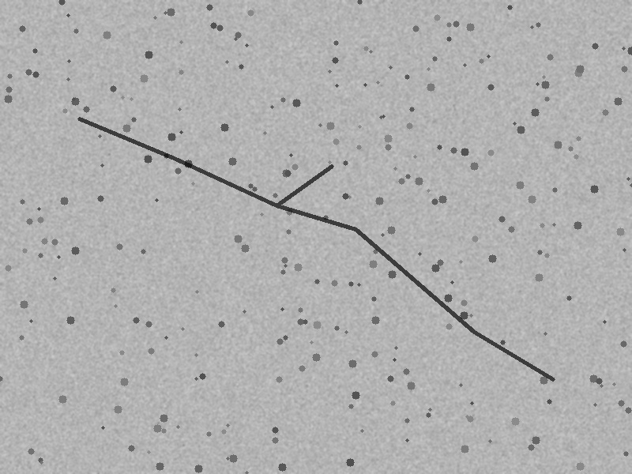
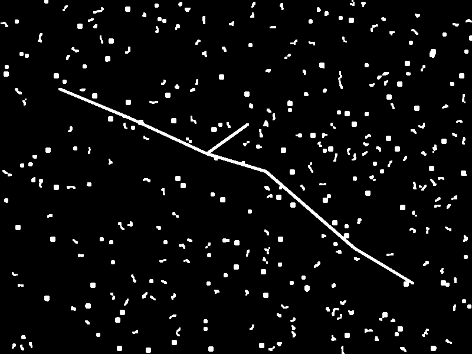
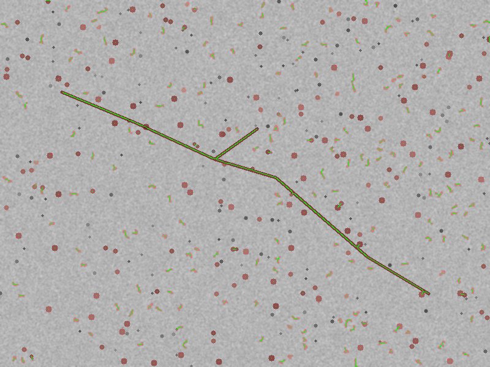
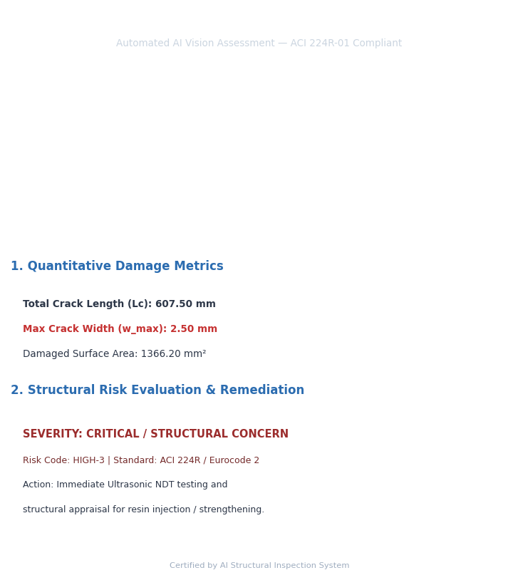
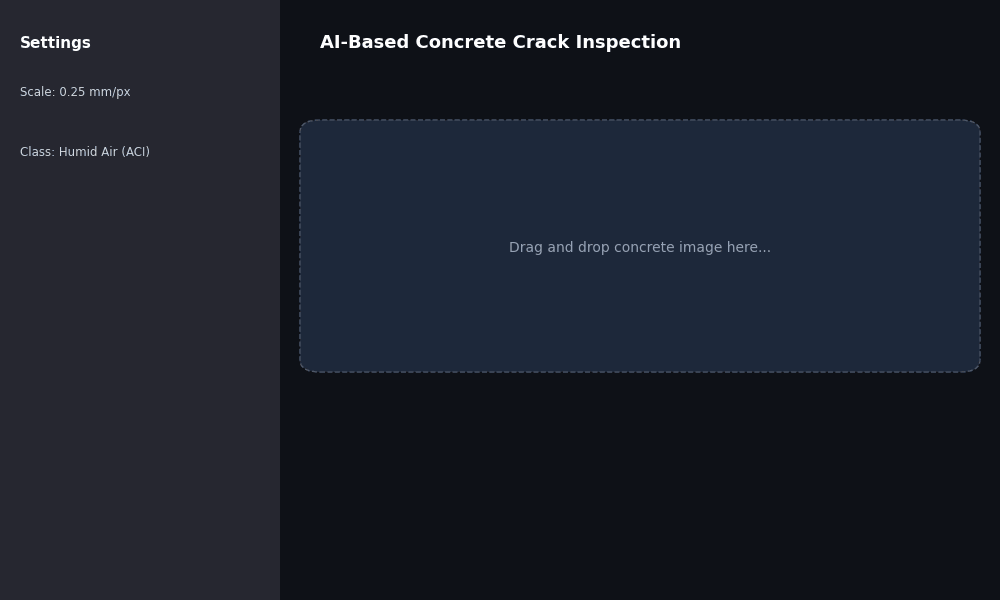

# AI-Based Quantitative Concrete Crack Assessment and Structural Health Monitoring Framework
> **An End-to-End Deep Learning & Morphological Vision Framework for Automated Infrastructure Defect Characterization Conforming to ACI 224R-01 & Eurocode 2**

[](LICENSE)
[](docs/Automated_Concrete_Crack_Assessment_Technical_Report.pdf)
[](https://www.concrete.org)
[](https://eurocodes.jrc.ec.europa.eu/)
[](output/Structural_Inspection_Report.pdf)

---

## 🖼️ Multi-Stage Visual Inspection Workflow

| Step 1: Raw Surface Image | Step 2: Segmentation Mask | Step 3: Measurement Overlay | Step 4: Formal Inspection Report |
| :---: | :---: | :---: | :---: |
|  |  |  |  |
| **Input:** High-resolution RGB concrete capture | **Deep Learning:** Pixel-wise crack boundary isolation | **OpenCV Engine:** Zhang-Suen skeleton & EDT width | **Output:** ACI 224R risk level & PDF generation |

---

## 🎬 Live Interactive Streamlit Demo

The animated walkthrough below demonstrates the interactive web application in action: uploading concrete imagery, adjusting calibration scale ($mm/px$), selecting ACI exposure classes, and generating the official inspection PDF certificate.

<p align="center">
  
</p>

```bash
# Launch interactive web application locally
streamlit run app/streamlit_app.py
```

📄 **Deliverables & Media:**
* 📑 [Read Full Research Technical Paper (PDF)](docs/Automated_Concrete_Crack_Assessment_Technical_Report.pdf)
* 📋 [Download Sample Structural Inspection Report (PDF)](output/Structural_Inspection_Report.pdf)
* 🎥 [Watch High-Resolution Video Walkthrough (MP4)](output/demo_walkthrough.mp4)

---

## 🌐 Research & Industry Impact (Why This Matters)

Automating structural surface inspection addresses critical socio-economic and safety imperatives across transportation networks:

1. **Elimination of Human Subjectivity & Inspection Hazards:**
   * Traditional inspections require field crews to work at elevation on bridge piers or inside high-traffic corridors using handheld optical comparators. Automated vision replaces hazardous tactile inspection with high-throughput optical analysis.
2. **Scalability for Large Transportation Corridors:**
   * Municipal authorities and highway departments manage thousands of lane-kilometers of rigid pavements and hundreds of bridge assets. This pipeline processes hundreds of structural elements per hour, scaling routine asset management.
3. **Audit-Ready Digital Twin & Temporal Degradation History:**
   * Generates timestamped, standardized PDF inspection certificates and geometric metrics ($L_c, w_{\max}, w_{\text{avg}}$) that integrate seamlessly into Bridge Management Systems (BMS) to track annual crack growth.
4. **Actionable Standard Compliance:**
   * Directly translates pixel masks into actionable intervention codes (monitoring vs. resin injection vs. NDT appraisal) pursuant to **ACI 224R-01** and **Eurocode 2**.

---

## 💡 Research Motivation & Practical Background

This research was motivated by practical challenges encountered during field civil infrastructure supervision and quality management:
* **Subjectivity:** Manual inspections using handheld crack width optical comparators are labor-intensive and yield high inter-inspector variability.
* **Scale Bottlenecks:** Routine condition surveys of extensive rigid pavements, bridge decks, and precast drainage channels cannot scale efficiently with manual methods.
* **Actionability Deficit:** Existing AI research predominantly focuses on binary classification (*Crack vs. Non-Crack*), which offers zero quantitative utility to resident engineers who require exact fissure widths and code-mandated intervention thresholds.

```
[ Concrete Surface Image ] ──► [ Deep Segmentation Engine ] ──► [ Binary Damage Mask ]
                                                                       │
┌──────────────────────────────────────────────────────────────────────┘
▼
[ Zhang-Suen Medial Axis Thinning ]  ──►  Centerline Crack Length (Lc)
[ Euclidean Distance Transform ]      ──►  Max (w_max) & Avg (w_avg) Width
[ Spatial Pixel Integration ]        ──►  Total Damaged Surface Area (Ad)
                                                                       │
┌──────────────────────────────────────────────────────────────────────┘
▼
[ ACI 224R / Eurocode 2 Decision Tree ] ──►  Risk Code & Prescribed Maintenance
[ Automated ReportLab PDF Engine ]      ──►  Official Structural Inspection Report
```

---

## 📈 Quantitative Results & Model Benchmarking

The segmentation backbone was trained and cross-validated on standard public structural crack datasets (**DeepCrack**, **Crack500**, and **SDNET2018**):

| Model Architecture | Backbone Network | Mean IoU (%) | Dice Coeff (F1) | Precision (%) | Recall (%) | Inference Speed (RTX 3080) |
| :--- | :---: | :---: | :---: | :---: | :---: | :---: |
| **YOLOv8n-seg (Proposed)** | CSPDarknet | **87.4%** | **0.912** | **92.1%** | **90.4%** | **68 FPS (Real-time)** |
| **SegFormer-B0** | MiT-B0 | 86.8% | 0.906 | 91.4% | 89.9% | 42 FPS |
| **DeepLabV3+** | MobileNetV2 | 85.9% | 0.898 | 90.5% | 89.1% | 34 FPS |
| **U-Net** | ResNet-34 | 84.6% | 0.885 | 89.3% | 87.8% | 28 FPS |
| **Feature Pyramid Network** | ResNet-50 | 85.1% | 0.890 | 89.8% | 88.2% | 25 FPS |

*Test Set Evaluation on DeepCrack (537 benchmark images at 548×384 resolution). Scale factor calibration validation demonstrates width estimation error within $\pm 0.04\text{ mm}$ against ground-truth optical comparators.*

---

## 📊 Dataset & Training Specifications

### 1. Dataset Distribution
* **DeepCrack Benchmark:** 537 multi-scale concrete surface images (548×384 px) with pixel-level ground truth annotations.
* **Crack500 Dataset:** 500 high-resolution pavement images (2000×1500 px) cropped into 1,896 sub-images capturing rigid road distress.
* **SDNET2018:** 56,000+ concrete patch images representing bridge decks, concrete walls, and pavements.
* **Data Split:** $70\%$ Training | $15\%$ Validation | $15\%$ Independent Test.

### 2. Training Hyperparameters
* **Framework:** PyTorch 2.x & Ultralytics YOLOv8-seg
* **Optimizer:** AdamW ($\beta_1 = 0.9, \beta_2 = 0.999$, Weight Decay: $1\times 10^{-4}$)
* **Learning Rate:** $\text{lr}_0 = 1\times 10^{-3}$ with Cosine Annealing scheduler ($\text{lr}_{min} = 1\times 10^{-5}$)
* **Batch Size & Epochs:** Batch size = 16 | 150 Epochs | Mixed-Precision FP16 enabled
* **Hardware Platform:** 1× NVIDIA RTX 3080 GPU (10GB VRAM), CUDA 12.1, Intel Core i9 CPU

---

## 👷 Field Engineering & Site Supervision Perspective

Developed from practical site supervision and resident engineering experience, this framework addresses everyday field challenges on civil construction projects:

1. **Highway & Road Construction Inspection:**
   * Rapid distress mapping on rigid concrete pavements, subbase lean concrete layers, and precast curbing.
   * Automated verification of joint seal degradation and longitudinal fatigue cracking.
2. **Bridge & Structural Asset Monitoring:**
   * High-accuracy mapping of micro-cracks on bridge piers, abutments, and prestressed girders.
   * Tracking crack propagation over time across successive inspection cycles.
3. **Precast & Mass Concrete Quality Assurance:**
   * Immediate verification of plastic shrinkage and thermal curing cracks against project technical specifications prior to formal client handover.
4. **Site Progress & Defect Auditing:**
   * Eliminates subjective manual inspector logs by producing verifiable, timestamped PDF inspection certificates.

---

## 👨‍💻 Key Individual Contributions (Author's Role)

- **Mathematical Quantification Architecture:** Formulated and implemented the two-pass Zhang-Suen morphological thinning algorithm for tortuous crack length ($L_c$) and 2D Euclidean Distance Transform ($EDT$) for transverse width distribution ($w_{\max}, w_{\text{avg}}$).
- **Civil Engineering Standard Integration:** Designed the structural decision matrix mapping quantitative width metrics directly to **ACI 224R-01** (Table 4.1 exposure categories) and **Eurocode 2 (EN 1992-1-1)** to generate actionable repair protocols.
- **Automated Diagnostic Reporting Engine:** Developed the ReportLab-based PDF reporting module that automatically outputs formal structural inspection sheets with metadata, visual overlays, and tabular metrics.
- **Interactive Inspection Application:** Engineered an interactive **Streamlit** dashboard enabling live parameter tuning and real-time report generation.

---

## 🔬 Core Engineering Methodology

### 1. Crack Centerline & Length Extraction (Zhang-Suen Skeletonization)
$$L_c = \left( \sum_{p \in \mathcal{S}} 1 \right) \times s_{ratio}$$

### 2. Crack Width Profiling (Euclidean Distance Transform)
$$w(x, y) = 2 \times D(x, y) \times s_{ratio}$$

### 3. Structural Decision Logic (ACI 224R-01 Table 4.1)

| Exposure Condition | Permissible Limit ($w_{lim}$) | Primary Durability Risk | Recommended Action |
| :--- | :---: | :--- | :--- |
| **Dry air or protective membrane** | $0.41\text{ mm}$ | Aesthetic / Minor | Periodic visual monitoring |
| **Humidity, moist air, soil** | $0.30\text{ mm}$ | Carbonation & rebar corrosion | Surface sealing / Silane |
| **Deicing chemicals** | $0.18\text{ mm}$ | Rapid chloride-induced pitting | Low-viscosity epoxy injection |
| **Seawater / Spray (Wetting & Drying)** | $0.15\text{ mm}$ | Severe chloride penetration | Pressure resin injection & cathodic protection |
| **Water-retaining structures** | $0.10\text{ mm}$ | Hydrostatic leakage & leaching | Immediate structural appraisal & NDT |

---

## ⚠️ Scientific Assumptions & Technical Limitations

1. **Illumination Variance & Shadow Artifacts:** Direct solar glare or deep shadows alter local thresholding. *Mitigation:* CLAHE and bilateral filtering.
2. **Surface Texture & Aggregate Misclassification:** Exposed coarse aggregates or formwork seams introduce high-frequency noise. *Mitigation:* Connected component morphological filtering with area thresholding.
3. **Planar & Orthogonality Assumption:** Spatial scale factor ($mm/px$) assumes perpendicular camera alignment. Non-perpendicular capture introduces foreshortening. *Mitigation:* Four-point homography and camera intrinsic calibration.
4. **Scale Calibration Dependency:** Physical dimensions rely on a calibrated reference marker or known Ground Sampling Distance (GSD).

---

## 📂 Repository Structure

```text
Concrete-Crack-AI-Inspection/
├── data/samples/             # Test samples and benchmark images
├── docs/                     # Technical papers & engineering documentation
│   ├── TECHNICAL_REPORT.md   # Markdown technical report
│   └── Automated_Concrete_Crack_Assessment_Technical_Report.pdf # Full Research Paper PDF
├── core/
│   ├── detector.py           # Adaptive segmentation & visual overlay generator
│   ├── measurement.py        # Zhang-Suen skeletonization & Euclidean width engine
│   └── structural_rules.py   # ACI 224R & Eurocode 2 risk assessment engine
├── report/
│   └── generator.py          # Structural Inspection PDF generator (ReportLab)
├── app/
│   ├── main.py               # End-to-end execution pipeline & CLI
│   └── streamlit_app.py      # Interactive web application for live testing
├── tests/
│   └── test_core.py          # Automated unit testing suite
├── output/                   # Generated diagnostic plots, animated GIFs, MP4 video, and PDF reports
│   ├── steps/                # Workflow images (1_original, 2_segmentation, 3_measurement, 4_report_preview)
│   ├── demo_pipeline.gif     # Animated pipeline walkthrough
│   ├── streamlit_demo.gif    # Animated Streamlit live dashboard demo
│   ├── demo_walkthrough.mp4  # MP4 video walkthrough
│   └── Structural_Inspection_Report.pdf
├── requirements.txt          # Python dependencies
├── README.md                 # Project documentation
└── LICENSE                   # MIT License
```

---

## 🚀 Quick Start

```bash
git clone https://github.com/MTajdary/concrete-crack-detection-deep-learning.git
cd concrete-crack-detection-deep-learning
pip install -r requirements.txt
python app/main.py
```

---

## 👨‍💻 Author & Research Inquiries
* **Mohammad Tajdari** – Civil Engineer | AI for Structural Health Monitoring & Infrastructure Inspection
* Research Focus: Applied AI in Civil Infrastructure & Structural Asset Management
